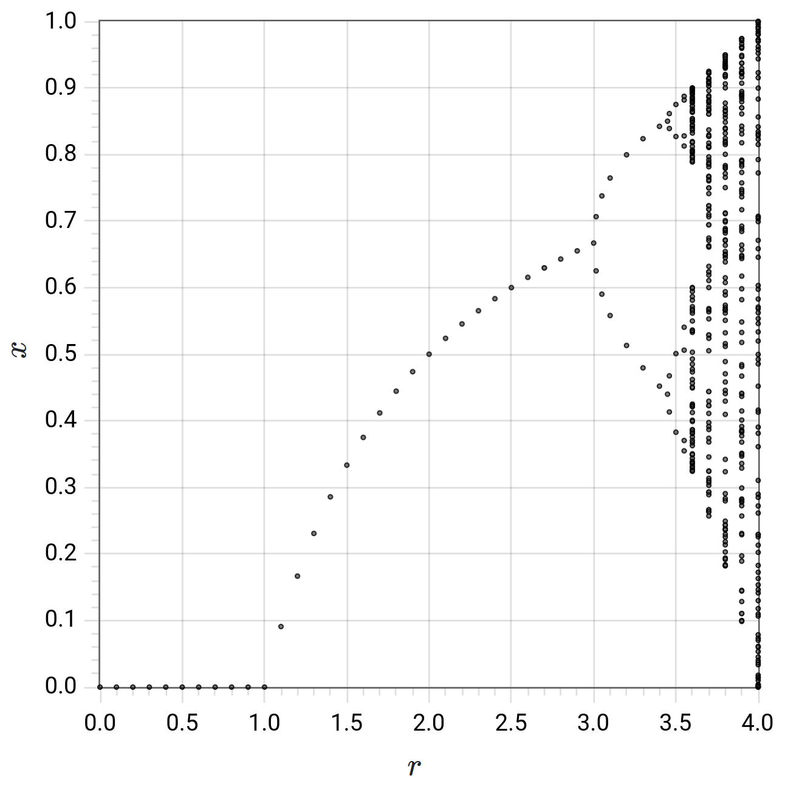

## Overview

**SSNS** is a web app that offers interactive exploration of various simple models/maps/equations/processes from a variety STEM fields.  The common theme is that they all involve straightforward update equations and display stochastic and/or nonlinear behavior.  In that sense, **SSNS** is a **S**imple **S**tochastic and **N**onlinear **S**imulator.

Being a web app, **SSNS** makes heavy use of HTML/CSS.  All computation and logic is done in object-oriented JavaScript &mdash; a "back-end" that actually runs client-side in the web browser.  The front-end is a user interface built with [Bootstrap](https://getbootstrap.com/) and [flot](https://www.flotcharts.org/) plotting.  Read on for details...

## Where To Find Things

**SSNS** can always be found "live" at [tedm.us/SSNS](https://tedm.us/SSNS).  If you're interested in knowing more about the app's design and code, here are some places to look:

* the app's integrated help viewer; visit [tedm.us/SSNS](https://tedm.us/SSNS) and click the big yellow "?"
* the JavaScript source ([<samp>/js/</samp>](/js/) and subdirectories), and the HTML source in [<samp>SSNS.html</samp>](SSNS.html)
* this README document
* the [<samp>/docs/class_diagrams/</samp>](/docs/class_diagrams/), which summarize the structure of the code; individual diagrams (example below) are available in both <samp>svg</samp> and <samp>pdf</samp>, and [<samp>all.pdf</samp>](/docs/class_diagrams/all.pdf) contains all diagrams

<a href="/docs/class_diagrams/Trajectory_inheritance_-_no_section_label.svg"></a>

## Classes, Hierarchies, etc.

The example class diagram pictured above and its companions in the [<samp>/docs/class_diagrams/</samp>](/docs/class_diagrams/) directory capture the structure of the **SSNS** code.  Individual diagrams will be linked to in this section as they come up.

The central class of the **SSNS** app is the <samp>Trajectory</samp>.  An implemented model/map/equation/process is referred to as a "system type" (for lack of a better term).  Each system type has its own <samp>Trajectory</samp> subclass &mdash; a leaf node on the <a href="/docs/class_diagrams/Trajectory_inheritance_-_no_section_label.svg"><samp>Trajectory</samp> inheritance</a> tree.  Its two-letter [abbreviation](#abbreviations-labels-etc) gives the subclass its name, e.g., <samp>Trajectory_XY</samp>.  There are also intermediate-level subclasses, e.g., <samp>Trajectory_Stoch</samp>.  The XY model uses stochastic machinery, so <samp>Trajectory_XY</samp> inherits from <samp>Trajectory_Stoch</samp>, which inherits from <samp>Trajectory</samp>.

A <samp>Trajectory</samp> object contains everything needed to generate output &mdash; and store it for "playback" &mdash; via iterative update equations.  Each <samp>Trajectory</samp> is <a href="/docs/class_diagrams/Trajectory_composition_-_no_section_label.svg">composed</a> of a <samp>ModelCalc</samp> object (to perform all model-specific calculations), and one or more <samp>TrajSeg</samp> objects to hold the trajectory data.  A <samp>TrajSeg</samp> represents a portion ("segment") of a trajectory evolved with a particular set of parameter values.  It is thus <a href="/docs/class_diagrams/TrajSeg_composition_-_no_section_label.svg">composed</a> of one <samp>Params</samp> object and one or more <samp>Coords</samp> objects.  Each <samp>Coords</samp> holds all dependent variable data for a single time step &mdash; it could be a single scalar value, or a large 2D matrix of values, integer or floating point, etc.

There are system-type-dependent class hierarchies for <a href="/docs/class_diagrams/Coords_inheritance.svg"><samp>Coords</samp></a> objects, <a href="/docs/class_diagrams/Params_inheritance.svg"><samp>Params</samp></a> objects, and <a href="/docs/class_diagrams/ModelCalc_inheritance.svg"><samp>ModelCalc</samp></a> objects.  The following table demonstrates the pattern of naming/inheritance/location for the <samp>Trajectory</samp>-related code:

<table>
<tbody>
<tr><th>file</th><th>contains classes</th><th>description</th></tr>
<tr><td><samp>traj_base.js</samp></td><td><samp>ModelCalc</samp>,&nbsp;&nbsp;&nbsp;<samp>Params</samp>,&nbsp;&nbsp;&nbsp;<samp>Coords</samp>,&nbsp;&nbsp;&nbsp;<samp>TrajSeg</samp>,&nbsp;&nbsp;&nbsp;<samp>Trajectory</samp></td><td>trajectory base classes</td></tr>
<tr><td><samp>traj_intermed.js</samp></td><td><samp>ModelCalc_Stoch</samp>, <samp>Trajectory_Stoch</samp>, <samp>CoordTransition_Spin</samp>, <samp>ModelCalc_SP</samp>, <samp>Coords_SP</samp>, <samp>Coords_SP_finite</samp>, <samp>Coords_SP_semiinf</samp>, <samp>Trajectory_SP</samp>, <samp>ModelCalc_Spin</samp>, <samp>Params_Spin</samp>, <samp>Coords_Spin</samp></td><td>trajectory intermediate classes</td></tr>
<tr><td><samp>system_types/RW.js</samp></td><td><samp>ModelCalc_RW</samp>,&nbsp;&nbsp;&nbsp;<samp>Params_RW</samp>,&nbsp;&nbsp;&nbsp;<samp>Coords_RW</samp>,&nbsp;&nbsp;&nbsp;<samp>Trajectory_RW</samp></td><td><samp>RW</samp>&nbsp;&nbsp;&nbsp;(random walk)</td></tr>
<tr><td><samp>system_types/MN.js</samp></td><td><samp>ModelCalc_MN</samp>,&nbsp;&nbsp;&nbsp;<samp>Params_MN</samp>,&nbsp;&nbsp;&nbsp;<samp>Coords_MN</samp>,&nbsp;&nbsp;&nbsp;<samp>Trajectory_MN</samp></td><td><samp>MN</samp>&nbsp;&nbsp;&nbsp;(Moran model)</td></tr>
<tr><td>...</td><td>...</td><td>...</td></tr>
</tbody>
</table>

At the cost of some flexibility, it was possible to keep the <samp>TrajSeg</samp> class system-type-independent, so it <em>does not</em> have a hierarchy.  On the data visualization side of things, there is an inheritance hierarchy for the <samp>PlotType</samp> class (but no diagram yet).  Referring to the section on [abbreviations](#abbreviations-labels-etc) can be helpful when viewing these hierarchies.  All other classes are not part of the <samp>Trajectory</samp> or plotting "ecosystems" &mdash; they do not have large class hierarchies and are mainly used as single instances.  Of note is the <samp>Simulator</samp> class that encompasses all **SSNS** app logic.  It is instantiated between a pair of <samp>script</samp> tags at end of [<samp>SSNS.html</samp>](SSNS.html).


## External Libraries, Dependencies

There are many fantastic JavaScript libraries out there!  **SSNS** relies on:

* [stdlib.js](https://stdlib.io/)<br/>for data structures, statistics, and pseudorandom number generation
* [flot](https://www.flotcharts.org/)<br/>for creating plots of trajectory data (flot does not have support for heat maps, so the native HTML <samp>&lt;canvas&gt;</samp> element is used instead)
* [Bootstrap](https://getbootstrap.com/)<br/>for UI components and responsive layout that displays well on both mobile and desktop browsers
* [KaTeX](https://www.katex.org/)<br/>for typesetting of math expressions
* [jQuery](https://jquery.com/)<br/>for simple and concise interaction with the HTML DOM
* [Font Awesome](https://fontawesome.com/)<br/>for nifty icons

For convenience, a minified bundle of all of these JavaScript dependencies is available in [<samp>SSNS_dependencies.js</samp>](dependencies/SSNS_dependencies.js).  There is version info within it.  As for stylesheets, the [<samp>SSNS.html</samp>](SSNS.html) <samp>&lt;head&gt;</samp> section has links to the CSS files for the Bootstrap and KaTeX libraries, as well as [<samp>SSNS.css</samp>](SSNS.css), which contains a small amount of **SSNS**-specific styling.

## Abbreviations, Labels, etc.

If you're trying to orient yourself in the code, the table of abbreviations below should keep things from feeling like total alphabet soup!

Many of the code's JavaScript variable names use two-letter abbreviations to indicate category, subcategory, etc.  For example, when using the Logistic Map (<samp>LM</samp>) system type, the derived class involved is <samp>Trajectory_LM</samp>.  <samp>PlotType</samp> derived classes contain two such abbreviations, e.g., <samp>PlotTypeXT_LM</samp>; the first abbreviation corresponds to the intermediate level branches in the <samp>PlotType</samp> [class hierarchy](#classes-hierarchies-etc); the second abbreviation, to the leaf nodes.

<table>
<tbody>
<tr><th colspan="2">general</th></tr>
<tr><td>Simple Stochastic and Nonlinear Simulator</td><td><samp>SSNS</samp></td></tr>
<tr><td>User Interface Numerical Input</td><td><samp>UINI</samp></td></tr>
<tr><td>User Interface Cyclic Input</td><td><samp>UICI</samp></td></tr>
<tr><td>System Type</td><td><samp>ST</samp></td></tr>
<tr><td>Plot Type</td><td><samp>PT</samp></td></tr>
<tr><td>User Interface</td><td><samp>UI</samp></td></tr>
<tr><td>Help Viewer</td><td><samp>HV</samp></td></tr>
<tr><th colspan="2">areas of system types</th></tr>
<tr><td>Stochastic Processes</td><td><samp>SP</samp></td></tr>
<tr><td>Statistical Mechanics</td><td><samp>SM</samp></td></tr>
<tr><td>Nonlinear Dynamics</td><td><samp>ND</samp></td></tr>
<tr><td>Fluid Dynamics</td><td><samp>FD</samp></td></tr>
<tr><th colspan="2">system types</th></tr>
<tr><td>Random Walk</td><td><samp>RW</samp></td></tr>
<tr><td>Moran Model</td><td><samp>MN</samp></td></tr>
<tr><td>Chemical System</td><td><samp>CH</samp></td></tr>
<tr><td>M/M/1 Queue</td><td><samp>QU</samp></td></tr>
<tr><td>2D Ideal Gas</td><td><samp>IG</samp></td></tr>
<tr><td>2D Hard Sphere Gas</td><td><samp>HS</samp></td></tr>
<tr><td>2D Ising Model</td><td><samp>IS</samp></td></tr>
<tr><td>XY Model</td><td><samp>XY</samp></td></tr>
<tr><td>Logistic Map</td><td><samp>LM</samp></td></tr>
<tr><td>Gingerbread-man Map</td><td><samp>GM</samp></td></tr>
<tr><td>Lorenz System</td><td><samp>LZ</samp></td></tr>
<tr><td>Sod Shock Tube</td><td><samp>SH</samp></td></tr>
<tr><td>Rigid Planar Flow</td><td><samp>PF</samp></td></tr>
<tr><th colspan="2">plot types</th></tr>
<tr><td>trajectory x(t)</td><td><samp>XT</samp></td></tr>
<tr><td>histogram H(x)</td><td><samp>HX</samp></td></tr>
<tr><td>HTML Canvas</td><td><samp>CV</samp></td></tr>
<tr><td>Phase Plane</td><td><samp>PP</samp></td></tr>
</tbody>
</table>

These abbreviations are also used in HTML element <samp>id</samp> attributes.  For instance <samp>UI_P_SP_MN_mu</samp> stands for "User Interface &mdash; Parameters &mdash; Stochastic Processes &mdash; Moran Model &mdash; parameter mu."  Every two-letter abbreviation above is unique ***across all categories***.

## Why JavaScript?

**SSNS** was originally envisioned with the following requirements:

* app should be accessible by web browser, quick to load, and not require installation/updating of anything
* language/library setup should offer basic scientific computing tools, including pseudorandom numbers; raw computational power is not as important 
* language/library setup should offer standard object-oriented programming capabilities

While JavaScript is not naturally suited to scientific computation, there were basically no language alternatives to consider.  (Maybe, if it were 2005, Java in the form of an [applet](https://en.wikipedia.org/wiki/Java_applet), but not any longer.)  The further narrowing to <em>client-side, non-dynamic JavaScript</em> freed us from complicating factors: no extended server-client communication ([Ajax](https://en.wikipedia.org/wiki/Ajax_(programming)), etc.), no transmission of data/graphics, no need for sustained network connectivity.  Rather, a simple web request loads the entire app in ~1 sec, and then it sits there &mdash; used or dormant &mdash; until the browser tab/window is closed.  Here are the pros/cons/takeaways of the **SSNS** JavaScript journey thus far:

* JavaScript's native <samp>Math.random()</samp> does not allow seeding or accessing the pseudorandom number generator's state, and there are not a lot of JavaScript library options for this sort of thing.  Happily, we settled on [stdlib.js](https://stdlib.io/), which has been solid.

* As of its 2015 revised standard, JavaScript added true classes.  ("Objects" had long been part of the language, but the term refers to a key-value-pair container.)  Certain OOP features like multiple constructors are still not possible, but JavaScript's new OOP capabilities served the needs of **SSNS** well, especially in the area of [class hierarchies](#classes-hierarchies-etc).

* There doesn't seem to be a JavaScript equivalent of the Python plotting library [matplotlib](https://matplotlib.org/).  Many web plotting packages focus on data exploration and novel visualization techniques, while we just needed something straightforward and lightweight.  The [flot](https://www.flotcharts.org/) library proved to be a good option.

* The main downside of having **SSNS** run in the user's web browser is that we must be preemptively careful not to overuse device/browser resources.  More on that [here](#general-cpumemorycomputation-considerations).

* All major browsers now have [developer tools](https://en.wikipedia.org/wiki/Web_development_tools) designed to assist web developers with debugging, etc.  But a tool such as the JavaScript Console can also provide useful information to the user &mdash; lots of **SSNS** informational-level messages are output there by default.

* Not only is the app source code available on GitHub under the very liberal MIT license, it is also always viewable "under the hood" by [viewing source](https://en.wikipedia.org/wiki/View-source_URI_scheme) in the browser.

## Input/Output

On load, the app plots the default initial condition of the default system type.  Pressing "play" at that point does nothing since no further trajectory has been recorded.  Once the trajectory consists of two or more time steps, all  navigation commands become available.

All input to the app is done via the user interface.  Please refer to the integrated help viewer's section on "How To Use" for details.  Note that many numeric input features, e.g., small increment/decrement arrows or popup numeric keyboards, will depend on choice of OS, browser, screen width, etc.

While some HTML UI entities like buttons and checkboxes can be used "as is", other app inputs are more involved.  Each of these more complicated input fields is implemented as an instance of one of two subclassable JavaScript classes: <samp>UINI</samp> (**U**ser **I**nterface **N**umerical **I**nput) or <samp>UICI</samp> (**U**ser **I**nterface **C**yclical **I**nput).  More details are available in the help viewer and the source code, but here some highlights of the <samp>UINI</samp> class:
  
* the entry field's HTML <samp>&lt;input&gt;</samp> element has <samp>type="number"</samp> and <samp>id</samp> attribute associating it with the corresponding internal <samp>UINI</samp> variable
* JavaScript has only a single multipurpose <samp>Number</samp> type, so <samp>UINI</samp> includes the two direct subclasses <samp>UINI_int</samp> and <samp>UINI_float</samp> to compensate
* the <samp>&lt;input&gt;</samp> element's <samp>value</samp> attribute is used to store the quantity's default value (read on app load by <samp>UINI</samp> constructor)
* the <samp>&lt;input&gt;</samp> element's <samp>min</samp> and <samp>max</samp> attributes store the quantity's range; out-of-range user input is immediately "auto-corrected" to the nearest in-range value
* when crossing <samp>TrajSeg</samp> boundaries during "playback", a <samp>UINI</samp> method facilitates the pushing of the corresponding stored parameter values back to the UI 

Reading/writing trajectory data is not implemented, nor planned, but would be very doable.  Screenshots are always possible, of course.  Finally, for those who favor keyboard navigation on a laptop/desktop:

* hit <samp>TAB</samp> to cycle through input buttons/fields; <samp>SHIFT-TAB</samp> to reverse
* if a button is currently selected, hit or hold <samp>ENTER</samp> to repeatedly "press" it
* if a numerical input is currently selected, hit or hold up/down arrows to change the value

## To Do/Fix/Add/Explore

* If you happen to spot a bug, please [report it](https://github.com/malliaris/SSNS/issues).  Comments, suggestions, and reports of confusing bug-like features also welcome!

* If you are technically inclined and interested in adding a new system type to **SSNS**, please [let us know](https://github.com/malliaris/SSNS/issues).  It could be as simple as picking a discrete map from [this list](https://en.wikipedia.org/wiki/List_of_chaotic_maps) and writing the necessary few small chunks of code.

* low priority items
  * not too familiar with how <samp>const</samp>ness works in JavaScript, but change <samp>let</samp> to <samp>const</samp> wherever possible
  * what about JavaScript "strict mode"?
  * handle support for very old browsers?

## Technical Notes

### Logistic Map Bifurcation Diagram Re-creation

Class <samp>PlotTypePP_LM</samp>, the phase-portrait "PP" type plot for the Logistic Map "LM" allows (with a bit of patience) re-creation of the well-known LM bifurcation diagram.  The main thing to realize is that the transient behavior in x(t) must be "discarded."  This is done by having <samp>PlotTypePP_LM</samp> inherit from <samp>PlotTypePP_Select</samp>, which only plots data points that have been actively added to the collection.  To use, follow the steps below.  Optionally, open your browser's developer tools console to view info along the way.  Screenshot of example plot result below.  Steps:

* THESE STEPS NEED TO BE UPDATED TO REFER TO THE NEW MACHINERY (aux_ctr instead of aux_toggle, etc.) BUT BASIC IDEA AND PROCEDURE IS THE SAME
* start by viewing the XT plot type (the default)
* select an r value
* record until x(t) settles in to its single steady value (or oscillations among a small number of values)
* pause the recording
* switch to PP plot type
* press the unmarked button next to the "Reload Page" button (console shows "this.ui.aux_toggle_ctrl = true", which means the PP setup is ready to record a data point)
* record a single step (console shows "data point (r, x) collected and appended")
* press the unmarked button again (console shows "this.ui.aux_toggle_ctrl = false") to temporarily stop data point capture
* repeat the above steps re-creating the diagram with as much detail as desired

<a href="/img/plot_screenshots/LM_PP_bifurcation_diagram.png"></a>

### Hard Sphere Gas p-V Diagram Creation

Class <samp>PlotTypePP_HS</samp>, the phase-portrait "PP" type plot for the Hard Sphere gas "HS" allows (with a bit of patience) creation of a p-V diagram with two isotherms, one adiabat, and "measured" data points that fall along them as the system state is methodically changed.  Each data point represents an equilibrium state, so the system must be allowed to equilibrate and then the measurement of pressure, etc. can commence.  To use, follow the steps below.  Optionally, open your browser's developer tools console to view info along the way.  Screenshot of example plot result below.  Steps:

* "plan" the data points by adjusting the values of Params_HS.x_RW_0 and the settings within UserInterface.update_aux_ctr_etc_for_HS_PP_isotherm_adiabat_plot_creation() (e.g., x_RW_lim_v_pist_arr); stopping the piston at specific x_RW values (and, therefore, volumes) is done by setting x_RW_max/min and v_pist; the piston will auto-stop once it hits its max or min value
* settle on reasonable values for other parameters... the example plot was made with:
	* N = 1000
	* kT0 = 1
	* RNG seed = 18 (happens to give sampled total energy very close to 1000)
	* IC: equilibrium
	* rho: single value
	* R: single value
	* Params_HS.target_area_frac = 0.001
	* Params_HS.ds = 1
* uncomment the line "this.ui.update_aux_ctr_etc_for_HS_PP_isotherm_adiabat_plot_creation();" in the case "CK": section of Simulator.js; this hooks things up to do incremental updates, cycling through a fixed number of tasks for each data point
* load SSNS anew (with a hard refresh to be safe) and repeat the following steps, Hitting the UnMarked Button "HUMB" in the UI to move from step to step, and noting pos_within_data_pt "PWDP" value, which cycles through 5 values
	* HUMB (PWDP = 0), a pause point at the beginning of cycle
	* HUMB (PWDP = 1), Params_HS.x_RW_max,min , vpist new values set and output in console
	* record forward in time until piston auto-stops at new position
	* continue recording until equilibrium is ~reached
	* HUMB (PWDP = 2), to enter accumulator reset mode
	* record one step to reset CollisionPressureStats accumulators
	* HUMB (PWDP = 3), to emerge from reset mode
	* record a good amount of trajectory to make measurement of pressure, etc. (Params_HS.ds = 1 means it could be ~10 steps -- this saves memory)
	* HUMB (PWDP = 4), to enter data point append mode
	* record one step to collect data point, which should show up with previously collected one in PP plot
	* HUMB (PWDP = 0), to emerge from data point append mode
 * take screenshot to capture plot image like below

<a href="/img/plot_screenshots/LM_PP_bifurcation_diagram.png"></a>

### General Time/Energy/Visualization/Computation Considerations

* in the points below, we use the Hard Sphere (HS) gas as an example, but most of the points are general; we distinguish between the SSNS-wide discrete time step "t" and the continuous time variable "s" present in any ST with continuous equations of motion 
* we must choose a value for Params_HS.ds to specify the amount of time that the equations of motion are moved forward during the recording of a new time step (i.e., t --> t + 1)
* apart from instantaneous collisions, all movement for a given particle at a given time is constant velocity; there are generally N >> 1 particles and a distribution of velocities among them
* in one discrete time step update, the same ds is applied to all particles, so there will be a distribution of distances moved
* the amount of real time for the HTML canvas to update the picture of the gas particles depends on various things, including N, area fraction eta, ds, etc.; the inverse of the real time duration is a "frame rate"
* for reasonable frame rate and distance moved per t for a given particle, its motion will appear smooth
* on the other hand, a particle that moves a longer distance, especially with one or more collisions along the way, will be harder to follow
* sometimes, we don't need smooth, easy-to-follow motion and we increase ds substantially; each new particle configuration bears little/no resemblance to the prior, but we will save on system memory since we don't have to store all those intermediate configurations; this is the approach taken <a href="#hard-sphere-gas-p-v-diagram-creation">here</a>
* generally, though, we aim for a smooth visual experience where individual particles can be tracked easily; we thus assume the user might explore energies over the 4 orders of magnitude from kT = 10^-2 to 10^2; the hard-coded (but editable) value of Params_HS.ds = 0.01 in HS.js means that particle motion will be barely perceptible at kT = 10^-2 (particles will almost appear stationary), while motion will proceed in large, hard-to-follow jumps at kT = 10^2
* for Ideal gas (IG), especially at low N, the computation is relatively light, so the frames can fly by making particles hard to track, even if they take reasonable sized steps; in this case, ds could be adjusted, but it might be a better idea to use the single-step navigation buttons and/or add a delay of a certain number of milliseconds using the UI's delay field

### General CPU/Memory/Computation Considerations

Most of the SSNS system types track one (or maybe a handful) of dependent variables over time, and so the derived <samp>Coords</samp> object for these systems has a very small memory footprint.  The big exceptions are the [statistical mechanical](https://en.wikipedia.org/wiki/Statistical_mechanics) systems &mdash; gas: <samp>IG</samp> and <samp>HS</samp>, and spin: <samp>IS</samp> and <samp>XY</samp>.  For them, the <samp>Coords</samp> object can be orders of magnitude larger as **N** (# of particles/spins, respectively) increases.  Furthermore, it is this large **N** limit that is the most relevant/interesting.  A few thoughts on this tension:

* **SSNS** is set up to <em>save</em> the system trajectory as it is generated ("recording"), and, in general, memory usage will increase linearly with time.  While the opposite approach (save the minimum needed to generate the next configuration) appears promising, it is complicated by the fact that memory management in JavaScript is fairly opaque and is handled by the browser, not the programmer.

* For our <samp>SM</samp> systems, **N** is fixed for a given <samp>Trajectory</samp> instance.  Since we certainly don't want to negatively impact device/browser performance, we find it easiest to both place an upper bound on **N**, and use the <samp>Trajectory</samp> method <samp>get_max_num_t_steps()</samp> to enforce an **N**-dependent max duration.  Even with such protections in place, it is important for the user to realize that real computation is being carried out on his or her device!

* Once we believe the user is adequately protected from overuse of resources, we ask whether anything interesting can be done with the amount computation that is available, and whether it's worth pursuing various measures to improve our computational reach and/or efficiency.

* We might consider a different type of molecular simulation altogether.  We have chosen to implement our <samp>SM</samp> gas systems with a standard [molecular dynamics](https://en.wikipedia.org/wiki/Molecular_dynamics) (MD) approach, but [Monte Carlo](https://en.wikipedia.org/wiki/Monte_Carlo_method) (MC) methods might be better, say, for examining the fluid-solid phase transition.  The  <samp>SM</samp> spin systems lack equations of motion, so an MD approach is not possible, but an MC move set expanded beyond our current single-spin-flips might be worth considering.

* As an example, Another angle is to reconsider exactly what is stored in the spin <samp>Coords</samp> object.  Currently, the Metropolis algorithm by which these system types are updated modifies 0 or 1 spins each time step.  <samp>CoordTransition_Spin</samp> is a lightweight auxiliary class that stores **only the change** between consecutive spin array configurations.  An entire trajectory can be stored as, say, the initial array configuration, and one <samp>CoordTransition_Spin</samp> for each subsequent time step.<br/><br/>This potential approach is complicated by the fact that we currently use the HTML <samp>&lt;canvas&gt;</samp> element for spin system plotting, and also by the fact that it's always good to allow for Metropolis "candidate moves" that change multiple spins.  See the code comments around <samp>CoordTransition_Spin</samp> in [js/traj_intermed.js](js/traj_intermed.js) and <samp>PlotTypeHM</samp> in [js/PlotTypeHM.js](js/PlotTypeHM.js).  Also see next bullet point, which is related.

* When it comes to web implementations of the <samp>XY</samp> model, ours pales in comparison to the one found <a href="//kjslag.github.io/XY/">here</a>, and for many reasons &#x1F642;.  One is that, despite always running on a device with a GPU, **SSNS** does not use the GPU for non-graphical computation!  With all the attention on machine learning, general purpose GPU ("GPGPU") computing is really progressing.  WebGL (which <samp>kjslag</samp>'s implementation uses) is about a decade old, and its successor, WebGPU, is coming out now.  This development comes on top of all the GPU technology progress spurred by HTML 5 <samp>&lt;video&gt;</samp>, streaming, etc.  It's not trivial to write code to execute on a GPU, but the potential performance jump alone is enough to keep this on the "to explore" list!


## Help Viewer "Sitemap"

This is basically the information contained in [<samp>js/help_viewer/network_structure.js</samp>](js/help_viewer/network_structure.js) with all charcters except node names and indentation removed, so that the hierarchical structure is clear.  (This is done by hand, so content may be a bit out of date!)

```
HV_HOME
    HV_USING
        HV_PLOT_AREA
        HV_MAIN_PANEL
        HV_C_CONTINUOUS_CMDS
        HV_PRMS_DROPDOWN
        HV_CTRL_DROPDOWN
            HV_C_ONE_STEP_CMDS
            HV_C_PLOT_TYPES
            HV_C_T_DT_JUMP
            HV_C_DELAY_WINDOW
            HV_C_T_0_MAX_STOP
            HV_C_RNG_RECR_TRAJ
            HV_C_SP_ENSEMBLE
            HV_C_RELOAD_CMDS
        HV_SYS_DROPDOWN
        HV_HELP_VIEWER
    HV_COMPUTATION
        HV_CODE_DESIGN
        HV_CODE_ORGANIZATION
        HV_CODE_DEPENDENCIES
        HV_CODE_IO
        HV_CODE_FUTURE
        HV_E_T_MAX_REACHED
        HV_E_NOT_IMPLEMENTED
    HV_CONCEPTS
        HV_ENSEMBLES
        HV_MARKOV_ONE_STEP
        HV_SPIN_SYSTEMS
        HV_PHASE_TRANSITIONS
        HV_GAS_MODELS
        HV_GAS_THEORY_COMPARISON
        HV_SA_SP
            HV_ST_RW
                HV_P_SP_RW_l
                HV_P_SP_RW_r
                HV_P_SP_RW_N
                HV_P_SP_RW_x_0
            HV_ST_MN
                HV_P_SP_MN_mu
                HV_P_SP_MN_s
                HV_P_SP_MN_N
                HV_P_SP_MN_x_0
        HV_SA_SM
            HV_ST_IG
                HV_P_SM_IG_N
                HV_P_SM_IG_V
                HV_P_SM_IG_kT0
                HV_P_SM_IG_BC
            HV_ST_HS
                HV_P_SM_HS_N
                HV_P_SM_HS_IC
                HV_P_SM_HS_rho
                HV_P_SM_HS_R
                HV_P_SM_HS_kT0
                HV_P_SM_HS_v_pist
            HV_ST_IS
                HV_P_SM_IS_T
                HV_P_SM_IS_h
                HV_P_SM_IS_N
            HV_ST_XY
                HV_P_SM_XY_T
                HV_P_SM_XY_h
                HV_P_SM_XY_N
        HV_SA_ND
            HV_ST_LZ
            HV_ST_LM
                HV_P_ND_LM_IC
                HV_P_ND_LM_r
                HV_P_ND_LM_x_0
            HV_ST_GM
                HV_P_ND_GM_IC
                HV_P_ND_GM_x_0
                HV_P_ND_GM_y_0
        HV_SA_FD
            HV_ST_SH
                HV_P_FD_SH_N
                HV_P_FD_SH_rho
                HV_P_FD_SH_p
            HV_ST_PF
                HV_P_FD_PF_Dpol
                HV_P_FD_PF_Ut
                HV_P_FD_PF_Ub
                HV_P_FD_PF_mu
                HV_P_FD_PF_Ds
                HV_P_FD_PF_N
```
